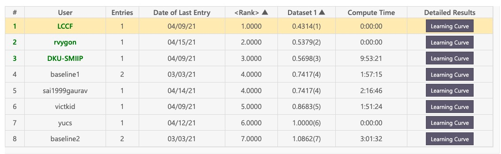

# INTERSPEECH2021 Auto-KWS 2021 Challenge 冠军方案

---
### 赛题见如下链接
比赛宣传页:[https://www.4paradigm.com/competition/autospeech2021](https://www.4paradigm.com/competition/autospeech2021)
Feedback Phase(初赛): [https://www.automl.ai/competitions/15#home](https://www.automl.ai/competitions/15#home)
Final Phase(复赛): [https://www.automl.ai/competitions/12#home](https://www.automl.ai/competitions/12#home)

---
### 代码说明    

主要代码是[enrollment.sh](enrollment.sh)和[predict.sh](predict.sh)。详细过程见脚本内注释。      

最优结果由两种STD模型融合+一个说话人模型(ECAPA-TDNN)获得。使用单个[CNN_QbE_STD](https://www.researchgate.net/profile/Dhananjay-Ram/publication/326185742_CNN_based_Query_by_Example_Spoken_Term_Detection/links/5b3cbde5a6fdcc8506ef6303/CNN-based-Query-by-Example-Spoken-Term-Detection.pdf)模型+[ECAPA-TDNN](https://arxiv.org/abs/2005.07143)模型在Feedback Phase可获得0.457的分数。

---
### Final Phase排行榜

---
### 致谢
感谢以下优秀的开源工作：
https://github.com/fauxneticien/bnf_cnn_qbe-std
https://github.com/idiap/CNN_QbE_STD
https://github.com/wenet-e2e/wenet
https://github.com/kaldi-asr/kaldi
https://huggingface.co/speechbrain/spkrec-ecapa-voxceleb
...

参考文献
[1] Dhananjay Ram, Lesly Miculicich, Herve Bourlard. CNN based Query by Example Spoken Term Detection. INTERSPEECH 2018.     
[2] Brecht Desplanques, Jenthe Thienpondt, Kris Demuynck. ECAPA-TDNN: Emphasized Channel Attention, Propagation and Aggregation in TDNN Based Speaker Verification. INTERSPEECH 2020.